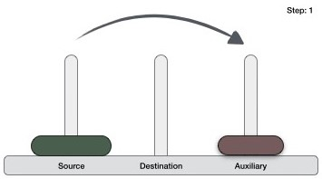
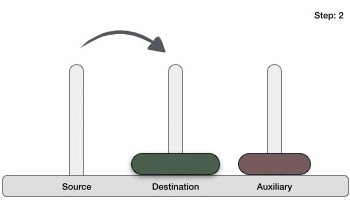
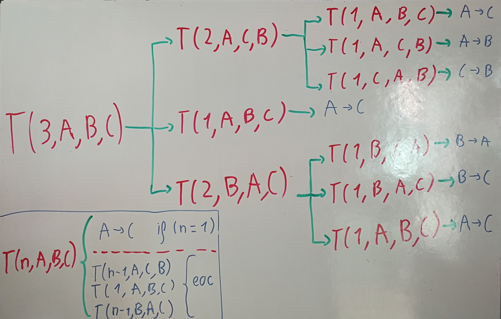

# Towers Of Hanoi
Implementation of the **Tower of Hanoi or Tower of Brahma** puzzle in Java.
It has an UI included and you can choose between Array or Stack for the Peg Structure. Besides
there is an study of the complexity at docs/report or in the Readme.md.
[Documentation](https://ull-esit-inf-daa-1718.github.io/ull-esit-inf-daa-1718-pract2-angeligareta/)

## Author
[Ángel Igareta](https://github.com/angeligareta)

## Problem description

The **Tower of Hanoi or Tower of Brahma** is a mathematical puzzle or game,
invented by the French mathematician Édouard Lucas in 1883.

The puzzle consists of **three pegs and a number of disks of different sizes**,
which can be introduced into any peg. Besides, the initial position of the
puzzle is a stack in ascending order of size on one peg, the smallest at the
top.

The aim of the puzzle is to move the stack to another rod, following the next 3
rules:

-   Only one disk can be moved at the same time.

-   Each move consists on taking the disk at the top of one peg and pushing into
    the top of another.

-   No disk can be placed above a smaller disk.

One interesting fact is that there is a story about an Indian temple which
contains a large room with 3 pegs in it, surrounded by 64 golden disks.
According to the legend, when the last move of the puzzle is completed, the
world will end. We will make the calculations later!

## Recursive Solution

To write the algorithm for Tower of Hanoi, first we need to understand the
problem and solve it with 1 or 2 amount of disks. For a better comprehension we
will call the pegs source, destination and auxiliary (this last one is only for
helping moving the disks).

If we have only one disk, the base case, it can be moved directly from source to
destination. However, if we have 2 disks we have to follow this 3 steps:

1.  Move the smaller disk to auxiliary peg.

2.  Move the bottom disk to the destination peg.

3.  Move the smaller disk from auxiliary to destination peg.






If we generalize this steps, we can design a recursive solution for Tower of
Hanoi problem. First, we divide the stack of disks in two parts, **the first one
contains the nth disk and the other one n-1 disks.** The steps are:

1.  Move the n-1 disks from source to auxiliary peg.

2.  Move the nth disk from source to destination peg.

3.  Move n-1 disks from auxiliary peg to destination peg.

If we follow those steps in each call, we will divide the problem until we reach
the base case.

## Pseudocode
```
void moveDisks(int numberOfDisks, Peg sourcePeg, Peg auxiliaryPeg, Peg destinationPeg) {

  if (numberOfDisks == 1) { // Base case

      // Move directly the disk from sourcePeg to destinationPeg.

      destinationPeg.push(sourcePeg.pop());

  }

  else {

      // 1. Move the n-1 disks from source to auxiliary peg.

      moveDisks(numberOfDisks - 1, sourcePeg, destinationPeg, auxiliaryPeg);

      // 2. Move the nth disk from source to destination peg.

      moveDisks(1, sourcePeg, auxiliaryPeg, destinationPeg);

      // 3. Move n-1 disks from auxiliary peg to destination peg.

      moveDisks(numberOfDisks - 1, auxiliaryPeg, sourcePeg, destinationPeg);

    }

}
```
The initial call would be with the origin values, as:
```
moveDisks(this.numberOfDisks, this.sourcePeg, this.auxiliaryPeg, this.destinationPeg);
```

## Algorithm complexity

To analyze the algorithm complexity first we will write the **recursive
function**. For finding it we will represent graphically the recursive calls
that the algorithm does. We will use the example of 3 as number of disks in the
Tower of Hanoi. In red there are the recursive calls and in blue the final
movement.



At the left-bottom corner we can see the recursive call. The base case is the
direct movement, when the number of disks is 1. In any other case the algorithm
makes 3 recursive calls, or 2 if we deduce that the second call is constant.

For analyzing the complexity of the algorithm I will represent graphically the
recursion tree:


As you can see in the picture there are n-1 levels of the recursion tree,
starting on level 0. In every level the size is the sum of all its sub problems.
At the right-top corner you can see a table where the level of the tree is
associated with the size of the sub problem. If we follow the pattern we can
deduce that in the k-level the size is 2k(n-k) + 2k-1.

Following that pattern, we can find the complexity of the problem, which is
represented in the bottom part of the picture. We start from the complexity of
the level 1 (2T(n-1) + 1), then the level 2 (22 T(n-2) + 2 + 1), and we find the
pattern. After that we can make the final summation and, after applying its
formula, we end up with a complexity of **2n – 1.**

## Algorithm test
For testing proposals, we will make a table and graphics with the execution time
for different input times in the recursive algorithm that is represented in the
point **2.1**. Furthermore, to test which structure type is more efficient
between stack or Array List we will execute the algorithm using that 2 different
types.

**Note: All the tests are made with the Java programming language.**

For showing the mean elapsed time for tests we have chosen the range between 25
and 37 because it’s where we can see a big difference in time. The result table
is:

| Disks | Movements   | Time Array  | Time Stack  | 1 Instruction Array | Approximated Time |
|-------|-------------|-------------|-------------|---------------------|-------------------|
| 25    | 33554431    | 0.243228258 | 1.070206778 | 7.24877E-09         | 0.238980811       |
| 26    | 67108863    | 0.462992979 | 1.285602947 | 6.89913E-09         | 0.477961629       |
| 27    | 134217727   | 0.967381949 | 2.344186338 | 7.20756E-09         | 0.955923264       |
| 28    | 268435455   | 1.863706762 | 5.107864988 | 6.94285E-09         | 1.911846536       |
| 29    | 536870911   | 3.928877135 | 9.365830825 | 7.3181E-09          | 3.823693079       |
| 30    | 1073741823  | 7.550789245 | 20.39955628 | 7.03222E-09         | 7.647386165       |
| 31    | 2147483647  | 15.52857167 | 37.4117279  | 7.23105E-09         | 15.29477234       |
| 32    | 4294967295  | 30.15800081 | 82.11768546 | 7.02171E-09         | 30.58954468       |
| 33    | 8589934591  | 62.22456867 | 149.0334849 | 7.24389E-09         | 61.17908937       |
| 34    | 17179869183 | 119.8980741 | 326.9518977 | 6.97899E-09         | 122.3581787       |
| 35    | 34359738367 | 248.4288268 | 598.2588013 | 7.23023E-09         | 244.7163575       |
| 36    | 68719476735 | 479.5327992 | 1320.087659 | 6.97812E-09         | 489.432715        |
| 37    | 1.37439E+11 | 997.2242081 | 2402.569439 | 7.25576E-09         | 978.86543         |

As we can see **the elapsed time using the peg as array is lot faster** than the
stack elapsed time, so we conclude that the Array Set of Disk is more efficient
than the Stack one (always that the elements are entered intelligently). **We
will use it for our calculations.**

If we look the time array difference between one disk and its predecessor, we
can see a difference of approximately its double. In fact, if we make a graphic
representing in the y axis the elapsed time and in the y axis the disks for that
elapsed time. **We can see that the function is very similar to 2n**, as
expected.

[CHART](docs/img/chart.jpg)

If we divide the array elapsed time and the number of movements for all the
number of disks between 25 and 37, and finally we make the mean we get:
```
1 Instruction -\> 7.25576E-09
```
**So, if the Hanoi Tower legend is true and we calculate the elapsed time for 64
disks the result in years would be 4166. However, it’s impossible to move the disks
manually at that speed, so we are safe!**
